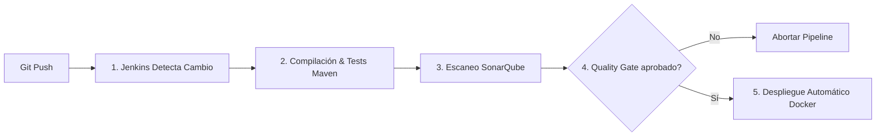

# 🎓 Generador de Exámenes - Arquitectura Backend & CI/CD 🚀

Este repositorio contiene la arquitectura backend para un sistema de generación y gestión de exámenes. Está diseñado bajo un enfoque de **Despliegue de Monolito Basado en Enrutamiento** (microservicios lógicos) y cuenta con un ciclo de vida de desarrollo completamente automatizado mediante un pipeline de **CI/CD**.

---

## 🏗️ Arquitectura del Sistema

El proyecto implementa un patrón donde una única base de código (el backend monolítico) se despliega en múltiples contenedores con diferentes identidades y responsabilidades lógicas. Esto permite lograr aislamiento de fallos, escalabilidad selectiva y resiliencia sin la complejidad de gestionar múltiples repositorios.

### Diagrama de la Arquitectura

```mermaid
graph TD
    Client[Cliente / Frontend] -->|Peticiones HTTP| Gateway[API Gateway :8082]
    
    subgraph Descubrimiento
        Eureka[Eureka Server :8761]
    end
    
    Gateway -.->|Descubrimiento de Servicios| Eureka
    MS_Auth -.->|Registro| Eureka
    MS_User -.->|Registro| Eureka
    MS_Roles -.->|Registro| Eureka
    MS_Examenes -.->|Registro| Eureka
    MS_Incidencias -.->|Registro| Eureka
    
    subgraph Backends Lógicos (Instancias del Monolito)
        MS_Auth[MS-AUTH]
        MS_User[MS-USUARIOS]
        MS_Roles[MS-ROLES]
        MS_Examenes[MS-EXAMENES]
        MS_Incidencias[MS-INCIDENCIAS]
    end
    
    Gateway -->|Enruta /auth/**| MS_Auth
    Gateway -->|Enruta /usuarios/**| MS_User
    Gateway -->|Enruta /roles/**| MS_Roles
    Gateway -->|Enruta /examenes/**, /intentos/**...| MS_Examenes
    Gateway -->|Enruta /incidencias/**| MS_Incidencias
    
    MS_Auth -->|JPA / Hibernate| DB[(MySQL DB :3307)]
    MS_User -->|JPA / Hibernate| DB
    MS_Roles -->|JPA / Hibernate| DB
    MS_Examenes -->|JPA / Hibernate| DB
    MS_Incidencias -->|JPA / Hibernate| DB
    
    style Gateway fill:#f9f,stroke:#333,stroke-width:2px
    style Eureka fill:#bbf,stroke:#333,stroke-width:2px
    style DB fill:#ffb,stroke:#333,stroke-width:2px
```

* **API Gateway (Puerto 8082):** Punto de entrada único para el exterior. Enruta dinámicamente las solicitudes hacia las instancias correspondientes del backend.
* **Eureka Server (Puerto 8761):** Registro y descubrimiento de microservicios.
* **Instancias de Backend Aisladas:** Cada contenedor del backend ejecuta la misma aplicación pero se registra bajo un nombre de servicio de Spring diferente (`MS-AUTH`, `MS-USUARIOS`, etc.).
  > [!IMPORTANT]
  > Por motivos de seguridad, los contenedores backend **no exponen puertos directamente al host**. Todo el tráfico debe ser validado y redirigido a través del **API Gateway**.

---

## 🛠️ Stack Tecnológico Detallado

A continuación se describen las tecnologías aplicadas y su rol dentro del ecosistema del proyecto:

### 1. Desarrollo Backend & Frameworks
* **Java 21 (LTS):** Lenguaje de programación principal, aprovechando características modernas de rendimiento y sintaxis (ej. patrones de registro, mejoras en la API de colecciones).
* **Spring Boot 4.0.3:** Framework base del ecosistema backend para agilizar la configuración, inyección de dependencias y desarrollo rápido de servicios REST.
* **Spring Cloud Gateway (WebMVC):** Puerta de enlace inteligente que gestiona la seguridad perimetral, la redirección de tráfico basada en predicados de ruta y el balanceo de carga.
* **Spring Cloud Netflix Eureka Server:** Servidor de registro para que los servicios se localicen entre sí sin necesidad de configurar direcciones IP de forma estática (Service Discovery).
* **Spring Cloud LoadBalancer:** Balanceador de carga del lado del cliente integrado con Eureka para distribuir las peticiones entre instancias del mismo microservicio.

### 2. Seguridad & Acceso
* **Spring Security:** Framework de seguridad encargado de las políticas de acceso a endpoints, filtros de autenticación y autorización basada en roles (`ADMIN`, `PROFESOR`, `ALUMNO`).
* **JSON Web Tokens (JWT) vía io.jsonwebtoken (JJWT 0.11.5):** Mecanismo de autenticación sin estado (stateless). El sistema emite un token firmado al iniciar sesión que el cliente adjunta en la cabecera `Authorization: Bearer <token>` para peticiones subsecuentes.
* **BCrypt (BCryptPasswordEncoder):** Algoritmo de hashing criptográfico unidireccional utilizado para almacenar las contraseñas de los usuarios de forma segura.

### 3. Persistencia de Datos
* **MySQL 8.0.33:** Base de datos relacional para el almacenamiento de preguntas, respuestas, categorías, intentos de exámenes, usuarios y roles.
* **Spring Data JPA & Hibernate:** Capa de abstracción de datos para interactuar con MySQL a través de entidades Java y repositorios (Object-Relational Mapping - ORM), lo cual agiliza la escritura de consultas SQL complejas.

### 4. Generación de Informes (PDF)
* **FreeMarker (Spring Boot Starter Freemarker):** Motor de plantillas Java para renderizar documentos HTML dinámicos a partir de archivos de plantilla `.ftlh` (`reporte_intento`, `reporte_notas_examen`, `reporte_usuarios`).
* **Flying Saucer (openpdf 9.1.22):** Biblioteca XML/XHTML que toma las plantillas HTML procesadas por FreeMarker (con estilos CSS incrustados) y las convierte directamente en documentos PDF listos para descarga.

### 5. Herramientas Auxiliares
* **Lombok (1.18.42):** Biblioteca de anotaciones para reducir el código repetitivo en Java, autogenerando getters, setters, constructores, patrones Builder y loggers de SLF4J en tiempo de compilación.
* **ModelMapper (3.0.0):** Biblioteca para mapear de manera automática modelos de entidad JPA a Objetos de Transferencia de Datos (DTO) para desacoplar la base de datos de la capa REST expuesta al cliente.
* **Springdoc OpenAPI (Swagger UI 2.8.13):** Generación automática de especificaciones OpenAPI 3. Accede a la interfaz visual interactiva para probar endpoints en caliente.

### 6. Calidad de Código & Pruebas
* **JUnit 5 & Spring Boot Starter Test:** Framework estándar para pruebas unitarias y de integración del backend.
* **JaCoCo Maven Plugin (0.8.10):** Herramienta que mide la cobertura del código ejecutado por las pruebas unitarias y genera informes que son consumidos por SonarQube.
* **SonarQube (LTS Community):** Plataforma de análisis estático de código para identificar vulnerabilidades de seguridad, malas prácticas, duplicación de código y evaluar la cobertura general de tests.

---

## 🏭 Pipeline de Integración y Despliegue Continuo (CI/CD)

El pipeline de automatización se encuentra configurado en el archivo [Jenkinsfile](file:///c:/Users/eaper/Examen/generador-examenes-back/Jenkinsfile). Este proceso se ejecuta dentro de un entorno Docker dedicado:



1. **Construcción (Maven):** Limpieza, compilación y empaquetado del proyecto (`mvn clean verify`). Se ejecutan los tests y se generan informes de cobertura de JaCoCo.
2. **Auditoría de Calidad (SonarQube):** Se ejecuta el escáner para evaluar el código fuente en busca de bugs, vulnerabilidades o malas prácticas.
3. **Quality Gate:** Jenkins consulta a SonarQube. Si no se superan los umbrales mínimos de calidad y cobertura de pruebas, el despliegue se aborta inmediatamente.
4. **Despliegue Automático:** Si el Quality Gate es exitoso, Jenkins instala Docker en caliente (si no está presente) y redespliega los servicios actualizados ejecutando:
   ```bash
   docker compose down
   docker compose up -d --build
   ```

---

## ⚙️ Estructura del Código Fuente (`examen-backend`)

El backend sigue un diseño modular y limpio:

* **[auth](file:///c:/Users/eaper/Examen/generador-examenes-back/examen-backend/src/main/java/com/eduardo/examen_backend/auth)**: Controladores y lógica de inicio de sesión y registro de usuarios.
* **[examenes](file:///c:/Users/eaper/Examen/generador-examenes-back/examen-backend/src/main/java/com/eduardo/examen_backend/examenes)**: Lógica principal para la gestión de categorías, preguntas, creación de exámenes e intentos de realización.
* **[incidencias](file:///c:/Users/eaper/Examen/generador-examenes-back/examen-backend/src/main/java/com/eduardo/examen_backend/incidencias)**: Registro automático y consulta de errores no controlados para propósitos de auditoría técnica.
* **[roles](file:///c:/Users/eaper/Examen/generador-examenes-back/examen-backend/src/main/java/com/eduardo/examen_backend/roles)**: Asignación y manejo de roles del sistema.
* **[security](file:///c:/Users/eaper/Examen/generador-examenes-back/examen-backend/src/main/java/com/eduardo/examen_backend/security)**: Configuración del filtro JWT, encriptación y control de acceso.
* **[shared](file:///c:/Users/eaper/Examen/generador-examenes-back/examen-backend/src/main/java/com/eduardo/examen_backend/shared)**: Clases de utilidad transversal como mapeadores globales, manejo de excepciones REST (`GlobalExceptionHandler`), configuración del sembrado inicial de datos (`DataSeederConfig`), servicios de auditoría y generación de PDFs.
* **[usuarios](file:///c:/Users/eaper/Examen/generador-examenes-back/examen-backend/src/main/java/com/eduardo/examen_backend/usuarios)**: CRUD y detalles operativos de los usuarios.

---

## 🚀 Cómo ejecutarlo localmente

### Prerrequisitos
* Tener instalado **Docker** y **Docker Compose**.
* Disponer del entorno Java (JDK 21) y Maven si deseas compilar de forma manual sin contenedores.

### Paso 1: Levantar el Entorno de CI/CD (Opcional)
Si quieres probar Jenkins y SonarQube localmente, sitúate en la carpeta `entorno-cicd` y ejecuta:
```bash
docker compose up -d
```
* **Jenkins:** Disponible en `http://localhost:8081`
* **SonarQube:** Disponible en `http://localhost:9000`

### Paso 2: Desplegar la Arquitectura de Microservicios Lógicos
Para levantar toda la infraestructura del sistema (Base de Datos, Eureka, Gateway y las 5 réplicas lógicas del backend):

1. Sitúate en la carpeta raíz de `examen-backend`.
2. Ejecuta el comando de despliegue:
   ```bash
   docker compose up -d --build
   ```

### Puertos Expuestos
* **Eureka Server Dashboard:** `http://localhost:8761`
* **API Gateway (Entrada REST única):** `http://localhost:8082`
* **Base de Datos MySQL:** `localhost:3307` (Credenciales: `eduardo`/`eduardopassword`)

---

## 📖 Documentación de la API (Swagger UI)

Una vez levantada la aplicación, puedes explorar e interactuar con todos los endpoints disponibles del sistema a través de la documentación autogenerada de Swagger:

🔗 **Swagger UI:** `http://localhost:8082/swagger-ui/index.html` (Tráfico enrutado a través de Gateway).
